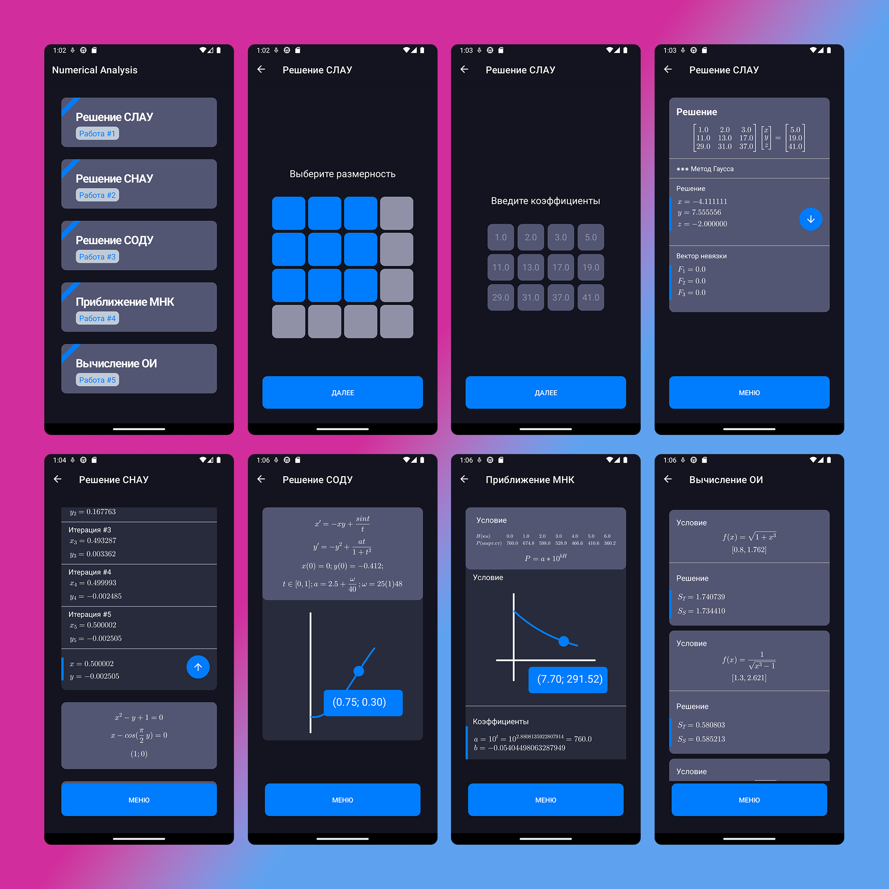

## NumericalAnalysis — Android Numerical Analysis App

Application made to solve different NA problems developed while study in university.

### Features:
 - Swipe/Touch Matrix size input
 - Pop-up items in list
 - Plot viewer with cursor (Shows XY coordinates)
 - [MathJax](https://github.com/mathjax/MathJax) to display LaTeX

### Screenshots

